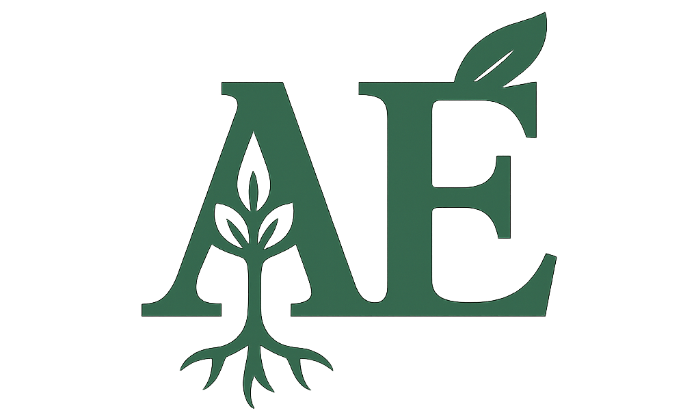

  

# Agroecosistemas 🌱

**Agroecosistemas** é uma plataforma interativa em formato de site _one page_ voltada ao ensino e consulta de conceitos ecológicos aplicados à produção agropecuária.

## 🔍 O que é?

Este projeto tem como objetivo facilitar a compreensão de como conceitos fundamentais da ecologia podem ser aplicados no estudo, análise e manejo de **agroecossistemas**. 
O conteúdo é apresentado em blocos explicativos, cada um abordando um conceito específico, como biodiversidade, sucessão ecológica, níveis de organização, entre outros.

## 🎯 Objetivo

Fornecer uma trilha de aprendizagem leve, acessível e didática sobre ecologia e agroecologia para estudantes, professores, agricultores e curiosos. O usuário pode:

- Rolar a página para explorar os conceitos sequencialmente;
- Utilizar a barra de busca para acessar diretamente um conceito específico;
- Navegar pela lista dropdown para encontrar temas de interesse.

## 🛠️ Tecnologias utilizadas

- **Angular 17**
- HTML / CSS
- GitHub Pages para deploy

## 🚧 Status do projeto

**Em desenvolvimento** – melhorias visuais e funcionais, bem como novos conceitos estão sendo adicionados.

## 🌐 Acesse o site

👉 [https://agroecossistemas.online/home](https://agroecossistemas.online/home)

## 👨‍💻 Autor

Desenvolvido por [Danilo Andrade Santos](https://daniloas.com)
